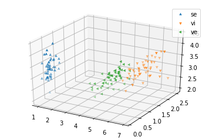
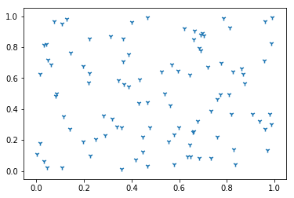
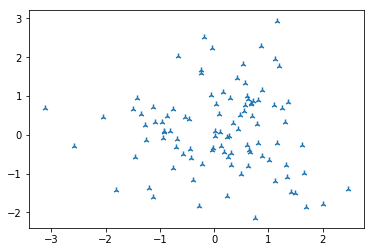
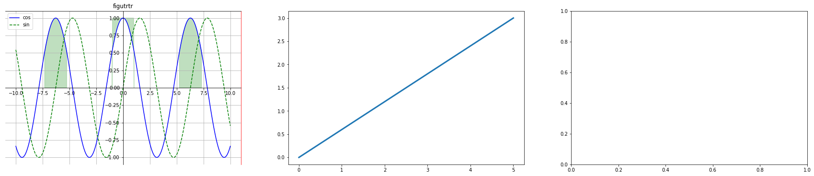
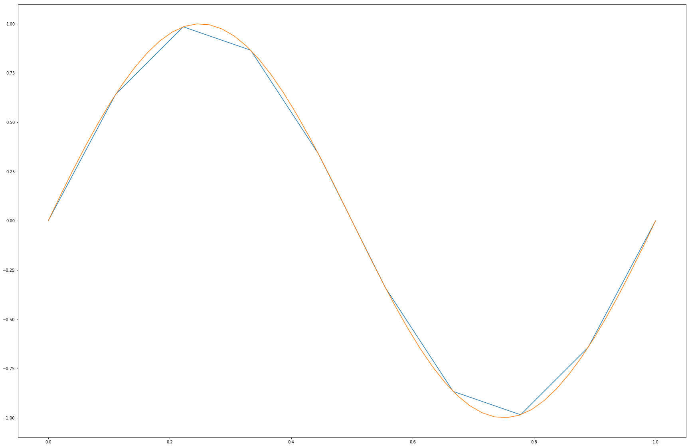
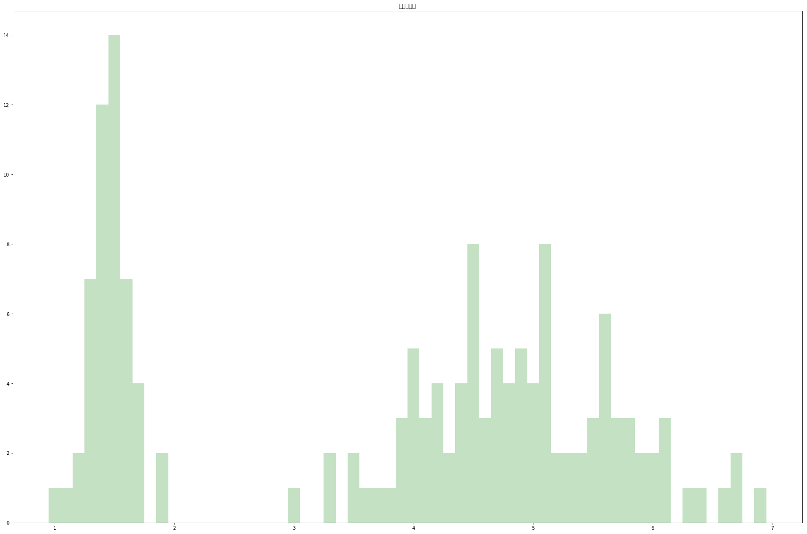

```python
# -- coding: gbk --
import pandas as pd
import numpy as np
import matplotlib.pyplot as plt
from mpl_toolkits.mplot3d import Axes3D
from sklearn import neighbors
from sklearn import datasets 
```

# 1.pandas数据集简单操作


```python
iris = pd.read_csv('../iris_byWPS.csv')
```


```python
iris[:10]
```


<div>
<style scoped>
    .dataframe tbody tr th:only-of-type {
        vertical-align: middle;
    }

    .dataframe tbody tr th {
        vertical-align: top;
    }

    .dataframe thead th {
        text-align: right;
    }
</style>
<table border="1" class="dataframe">
  <thead>
    <tr style="text-align: right;">
      <th></th>
      <th>sepal_length</th>
      <th>sepal_width</th>
      <th>petal_length</th>
      <th>petal_width</th>
      <th>Class</th>
    </tr>
  </thead>
  <tbody>
    <tr>
      <th>0</th>
      <td>5.1</td>
      <td>3.5</td>
      <td>1.4</td>
      <td>0.2</td>
      <td>Iris-setosa</td>
    </tr>
    <tr>
      <th>1</th>
      <td>4.9</td>
      <td>3.0</td>
      <td>1.4</td>
      <td>0.2</td>
      <td>Iris-setosa</td>
    </tr>
    <tr>
      <th>2</th>
      <td>4.7</td>
      <td>3.2</td>
      <td>1.3</td>
      <td>0.2</td>
      <td>Iris-setosa</td>
    </tr>
    <tr>
      <th>3</th>
      <td>4.6</td>
      <td>3.1</td>
      <td>1.5</td>
      <td>0.2</td>
      <td>Iris-setosa</td>
    </tr>
    <tr>
      <th>4</th>
      <td>5.0</td>
      <td>3.6</td>
      <td>1.4</td>
      <td>0.2</td>
      <td>Iris-setosa</td>
    </tr>
    <tr>
      <th>5</th>
      <td>5.4</td>
      <td>3.9</td>
      <td>1.7</td>
      <td>0.4</td>
      <td>Iris-setosa</td>
    </tr>
    <tr>
      <th>6</th>
      <td>4.6</td>
      <td>3.4</td>
      <td>1.4</td>
      <td>0.3</td>
      <td>Iris-setosa</td>
    </tr>
    <tr>
      <th>7</th>
      <td>5.0</td>
      <td>3.4</td>
      <td>1.5</td>
      <td>0.2</td>
      <td>Iris-setosa</td>
    </tr>
    <tr>
      <th>8</th>
      <td>4.4</td>
      <td>2.9</td>
      <td>1.4</td>
      <td>0.2</td>
      <td>Iris-setosa</td>
    </tr>
    <tr>
      <th>9</th>
      <td>4.9</td>
      <td>3.1</td>
      <td>1.5</td>
      <td>0.1</td>
      <td>Iris-setosa</td>
    </tr>
  </tbody>
</table>
</div>


```python
sl = 'sepal_length'
sw = 'sepal_width'
pl = 'petal_length'
pw = 'petal_width'
cl = 'Class'
```


```python
c1 = iris[iris[cl] == 'Iris-setosa']
c2 = iris[iris[cl] == 'Iris-virginica']
c3 = iris[iris[cl] == 'Iris-versicolor']
```

## 1.1画图


```python
ax = plt.subplot(111, projection='3d')
ax.scatter(c1[pl], c1[pw], c1[sw],marker='2',label='se')
ax.scatter(c2[pl], c2[pw], c2[sw],marker='1',label = 'vi')
ax.scatter(c3[pl], c3[pw], c3[sw],marker='3', label = 've')
ax.legend()
#plt.legend((type1, type2, type3), ('不喜欢', '魅力一般', '极具魅力'))
```


    <matplotlib.legend.Legend at 0x151caa6b6d8>





```python
data = iris.values
ndata = np.array(data)
type(data),type(ndata),data.ndim,data.itemsize
```


    (numpy.ndarray, numpy.ndarray, 2, 8)


# 2.numpy入门操作


```python
np.ones([3,2,2])
```


    array([[[1., 1.],
            [1., 1.]],
    
           [[1., 1.],
            [1., 1.]],
    
           [[1., 1.],
            [1., 1.]]])


```python
data1 = np.random.rand(2,100)#均匀随机数
plt.scatter(data1[0],data1[1], marker='1')
```


    <matplotlib.collections.PathCollection at 0x151cab379e8>





```python
data2 = np.random.randn(2,100)#正态分布随机
plt.scatter(data2[0],data2[1], marker='2')
```


    <matplotlib.collections.PathCollection at 0x151cab94fd0>





```python
# help(np.random.choice)
np.random.choice(a=[3,4,5], size=(2,3)) #选择随机数
```


    array([[4, 4, 4],
           [4, 4, 5]])


```python
data = np.arange(start = 20, stop = 0, step = -2) #等差数列
data = data.reshape([5,2])
data
```


    array([[20, 18],
           [16, 14],
           [12, 10],
           [ 8,  6],
           [ 4,  2]])


```python
print(data+data)
print(np.log(data))#算数运算
```

    [[40 36]
     [32 28]
     [24 20]
     [16 12]
     [ 8  4]]
    [[2.99573227 2.89037176]
     [2.77258872 2.63905733]
     [2.48490665 2.30258509]
     [2.07944154 1.79175947]
     [1.38629436 0.69314718]]
    


```python
print(data.sum(axis=1))#维度求和
print(data.sum(axis=0))
```

    [38 30 22 14  6]
    [60 50]
    


```python
print("追加",np.concatenate((data,data),axis = 0))#追加
print("分离",np.split(data,5))
```

    追加 [[20 18]
     [16 14]
     [12 10]
     [ 8  6]
     [ 4  2]
     [20 18]
     [16 14]
     [12 10]
     [ 8  6]
     [ 4  2]]
    分离 [array([[20, 18]]), array([[16, 14]]), array([[12, 10]]), array([[8, 6]]), array([[4, 2]])]
    

# 3 numpy线性运算


```python
 from numpy.linalg import *
```


```python
np.eye(3) #单位矩阵
```


    array([[1., 0., 0.],
           [0., 1., 0.],
           [0., 0., 1.]])


```python
data = np.random.randint(1,5,[3,3])
data
```


    array([[2, 2, 3],
           [3, 4, 1],
           [2, 4, 1]])


```python
inv(data)#逆矩阵
```


    array([[ 0. ,  1. , -1. ],
           [-0.1, -0.4,  0.7],
           [ 0.4, -0.4,  0.2]])


```python
data.transpose()#转置矩阵
```


    array([[2, 3, 2],
           [2, 4, 4],
           [3, 1, 1]])


```python
#行列式
det(data)
```


    10.000000000000002


```python
eig(data) #特征值和特征向量
```


    (array([ 7.44873521+0.j        , -0.22436761+1.13673611j,
            -0.22436761-1.13673611j]),
     array([[ 0.53892976+0.j        ,  0.7373556 +0.j        ,
              0.7373556 -0.j        ],
            [ 0.63070823+0.j        , -0.40196853-0.20696654j,
             -0.40196853+0.20696654j],
            [ 0.55835638+0.j        , -0.27873761+0.4173706j ,
             -0.27873761-0.4173706j ]]))


```python
y = np.array([[5],[7],[2]])
solve(data,y)
#解方程组（data·X = y）,求X
```


    array([[ 5. ],
           [-1.9],
           [-0.4]])


## numpy其他应用


```python
np.fft.fft(np.array([1,1,1,1,1,1]))#阶跃函数
```


    array([6.+0.j, 0.+0.j, 0.+0.j, 0.+0.j, 0.+0.j, 0.+0.j])


```python
print(np.poly1d([4,1,3])) #函数生成
f = np.poly1d([4,1,3])
```

       2
    4 x + 1 x + 3
    


```python
f(2) #函数求值
```


    21


## matplotlib工具

### 改变jupyter中图片显示大小


```python
import pylab
pylab.rcParams['figure.figsize'] = (30.0, 20.0) # 显示大小,可以提高分辨率
```


```python
#######line########
x = np.linspace(-10,10,1000)
c,s = np.cos(x),np.sin(x)
fig = plt.figure()

########画布#######
fig.add_subplot(3,3,1)
plt.plot(x,c,c='b',label='cos')
plt.plot(x,s,'g--',label='sin')#绿色*型
plt.legend()
plt.title("figutrtr")
########边界#######
ax = plt.gca()
ax.spines['right'].set_color('red')
ax.spines['left'].set_position(("data",0))
ax.spines['bottom'].set_position(("data",0))
plt.grid()#网格
# plt.axis([-5,5,-1.5,1.5]) #显示范围
plt.fill_between(x, np.abs(x)<1,c,c>0.5,color='g',alpha = 0.25)

########子图########
fig.add_subplot(332)
plt.plot([0,5],[0,3],linewidth=3) #画直线
fig.add_subplot(333)

```


    <matplotlib.axes._subplots.AxesSubplot at 0x151cac41e80>





```python
data1 = iris[pl].value_counts()
data2 = iris[pl].unique()
```


```python
data1.plot
```


    <pandas.plotting._core.SeriesPlotMethods object at 0x00000151CB8EF860>


>还有多种图形，参考慕课网《数据科学入门与实战》matplotlib章节最后一节
# scipy基础


```python
from scipy.integrate import quad,dblquad,nquad #一元和二元积分
```


```python
print(quad(lambda x:np.exp(-x),0,np.inf)) #显示积分值和误差（积分原理导致）
```

    (1.0000000000000002, 5.842606996763696e-11)
    


```python
print(dblquad(lambda t,x:np.exp(-x*t)/t**3,0,np.inf,lambda x:1,lambda x:np.inf)) #二元积分
```

    (0.3333333333366853, 1.3888461883425516e-08)
    

## scipy插值


```python
x= np.linspace(0,1,10)
y = np.sin(2*np.pi*x)
```


```python
from scipy.interpolate import interp1d
```


```python
li = interp1d(x,y,kind='cubic')
x_new = np.linspace(0,1,50)
y_new = li(x_new)
```


```python
plt.plot(x,y)
plt.plot(x_new,y_new)
```


    [<matplotlib.lines.Line2D at 0x151cb8df400>]





```python
uni = iris[pl].unique()
count = iris[pl].value_counts()
plt.bar(uni,count[uni],color='g',alpha=0.23,width=0.1)
plt.title("频度统计图")
```


    Text(0.5,1,'频度统计图')





# pandas补充


```python
s = pd.Series([i*2 for i in range(1,11)])
```


```python
dates = pd.date_range("20170301", periods=8)
df = pd.DataFrame({'A':1,'B':pd.Timestamp("20170301"),'C':pd.Series(1, index=list(range(5)))})
dates
```


    DatetimeIndex(['2017-03-01', '2017-03-02', '2017-03-03', '2017-03-04',
                   '2017-03-05', '2017-03-06', '2017-03-07', '2017-03-08'],
                  dtype='datetime64[ns]', freq='D')


```python
iris.head()
```


<div>
<style scoped>
    .dataframe tbody tr th:only-of-type {
        vertical-align: middle;
    }

    .dataframe tbody tr th {
        vertical-align: top;
    }

    .dataframe thead th {
        text-align: right;
    }
</style>
<table border="1" class="dataframe">
  <thead>
    <tr style="text-align: right;">
      <th></th>
      <th>sepal_length</th>
      <th>sepal_width</th>
      <th>petal_length</th>
      <th>petal_width</th>
      <th>Class</th>
    </tr>
  </thead>
  <tbody>
    <tr>
      <th>0</th>
      <td>5.1</td>
      <td>3.5</td>
      <td>1.4</td>
      <td>0.2</td>
      <td>Iris-setosa</td>
    </tr>
    <tr>
      <th>1</th>
      <td>4.9</td>
      <td>3.0</td>
      <td>1.4</td>
      <td>0.2</td>
      <td>Iris-setosa</td>
    </tr>
    <tr>
      <th>2</th>
      <td>4.7</td>
      <td>3.2</td>
      <td>1.3</td>
      <td>0.2</td>
      <td>Iris-setosa</td>
    </tr>
    <tr>
      <th>3</th>
      <td>4.6</td>
      <td>3.1</td>
      <td>1.5</td>
      <td>0.2</td>
      <td>Iris-setosa</td>
    </tr>
    <tr>
      <th>4</th>
      <td>5.0</td>
      <td>3.6</td>
      <td>1.4</td>
      <td>0.2</td>
      <td>Iris-setosa</td>
    </tr>
  </tbody>
</table>
</div>


```python
iris.tail()
```


<div>
<style scoped>
    .dataframe tbody tr th:only-of-type {
        vertical-align: middle;
    }

    .dataframe tbody tr th {
        vertical-align: top;
    }

    .dataframe thead th {
        text-align: right;
    }
</style>
<table border="1" class="dataframe">
  <thead>
    <tr style="text-align: right;">
      <th></th>
      <th>sepal_length</th>
      <th>sepal_width</th>
      <th>petal_length</th>
      <th>petal_width</th>
      <th>Class</th>
    </tr>
  </thead>
  <tbody>
    <tr>
      <th>145</th>
      <td>6.7</td>
      <td>3.0</td>
      <td>5.2</td>
      <td>2.3</td>
      <td>Iris-virginica</td>
    </tr>
    <tr>
      <th>146</th>
      <td>6.3</td>
      <td>2.5</td>
      <td>5.0</td>
      <td>1.9</td>
      <td>Iris-virginica</td>
    </tr>
    <tr>
      <th>147</th>
      <td>6.5</td>
      <td>3.0</td>
      <td>5.2</td>
      <td>2.0</td>
      <td>Iris-virginica</td>
    </tr>
    <tr>
      <th>148</th>
      <td>6.2</td>
      <td>3.4</td>
      <td>5.4</td>
      <td>2.3</td>
      <td>Iris-virginica</td>
    </tr>
    <tr>
      <th>149</th>
      <td>5.9</td>
      <td>3.0</td>
      <td>5.1</td>
      <td>1.8</td>
      <td>Iris-virginica</td>
    </tr>
  </tbody>
</table>
</div>


```python
iris.T #转置
```


<div>
<style scoped>
    .dataframe tbody tr th:only-of-type {
        vertical-align: middle;
    }

    .dataframe tbody tr th {
        vertical-align: top;
    }

    .dataframe thead th {
        text-align: right;
    }
</style>
<table border="1" class="dataframe">
  <thead>
    <tr style="text-align: right;">
      <th></th>
      <th>0</th>
      <th>1</th>
      <th>2</th>
      <th>3</th>
      <th>4</th>
      <th>5</th>
      <th>6</th>
      <th>7</th>
      <th>8</th>
      <th>9</th>
      <th>...</th>
      <th>140</th>
      <th>141</th>
      <th>142</th>
      <th>143</th>
      <th>144</th>
      <th>145</th>
      <th>146</th>
      <th>147</th>
      <th>148</th>
      <th>149</th>
    </tr>
  </thead>
  <tbody>
    <tr>
      <th>sepal_length</th>
      <td>5.1</td>
      <td>4.9</td>
      <td>4.7</td>
      <td>4.6</td>
      <td>5</td>
      <td>5.4</td>
      <td>4.6</td>
      <td>5</td>
      <td>4.4</td>
      <td>4.9</td>
      <td>...</td>
      <td>6.7</td>
      <td>6.9</td>
      <td>5.8</td>
      <td>6.8</td>
      <td>6.7</td>
      <td>6.7</td>
      <td>6.3</td>
      <td>6.5</td>
      <td>6.2</td>
      <td>5.9</td>
    </tr>
    <tr>
      <th>sepal_width</th>
      <td>3.5</td>
      <td>3</td>
      <td>3.2</td>
      <td>3.1</td>
      <td>3.6</td>
      <td>3.9</td>
      <td>3.4</td>
      <td>3.4</td>
      <td>2.9</td>
      <td>3.1</td>
      <td>...</td>
      <td>3.1</td>
      <td>3.1</td>
      <td>2.7</td>
      <td>3.2</td>
      <td>3.3</td>
      <td>3</td>
      <td>2.5</td>
      <td>3</td>
      <td>3.4</td>
      <td>3</td>
    </tr>
    <tr>
      <th>petal_length</th>
      <td>1.4</td>
      <td>1.4</td>
      <td>1.3</td>
      <td>1.5</td>
      <td>1.4</td>
      <td>1.7</td>
      <td>1.4</td>
      <td>1.5</td>
      <td>1.4</td>
      <td>1.5</td>
      <td>...</td>
      <td>5.6</td>
      <td>5.1</td>
      <td>5.1</td>
      <td>5.9</td>
      <td>5.7</td>
      <td>5.2</td>
      <td>5</td>
      <td>5.2</td>
      <td>5.4</td>
      <td>5.1</td>
    </tr>
    <tr>
      <th>petal_width</th>
      <td>0.2</td>
      <td>0.2</td>
      <td>0.2</td>
      <td>0.2</td>
      <td>0.2</td>
      <td>0.4</td>
      <td>0.3</td>
      <td>0.2</td>
      <td>0.2</td>
      <td>0.1</td>
      <td>...</td>
      <td>2.4</td>
      <td>2.3</td>
      <td>1.9</td>
      <td>2.3</td>
      <td>2.5</td>
      <td>2.3</td>
      <td>1.9</td>
      <td>2</td>
      <td>2.3</td>
      <td>1.8</td>
    </tr>
    <tr>
      <th>Class</th>
      <td>Iris-setosa</td>
      <td>Iris-setosa</td>
      <td>Iris-setosa</td>
      <td>Iris-setosa</td>
      <td>Iris-setosa</td>
      <td>Iris-setosa</td>
      <td>Iris-setosa</td>
      <td>Iris-setosa</td>
      <td>Iris-setosa</td>
      <td>Iris-setosa</td>
      <td>...</td>
      <td>Iris-virginica</td>
      <td>Iris-virginica</td>
      <td>Iris-virginica</td>
      <td>Iris-virginica</td>
      <td>Iris-virginica</td>
      <td>Iris-virginica</td>
      <td>Iris-virginica</td>
      <td>Iris-virginica</td>
      <td>Iris-virginica</td>
      <td>Iris-virginica</td>
    </tr>
  </tbody>
</table>
<p>5 rows × 150 columns</p>
</div>


```python
iris.sort_values(pl).head()
```


<div>
<style scoped>
    .dataframe tbody tr th:only-of-type {
        vertical-align: middle;
    }

    .dataframe tbody tr th {
        vertical-align: top;
    }

    .dataframe thead th {
        text-align: right;
    }
</style>
<table border="1" class="dataframe">
  <thead>
    <tr style="text-align: right;">
      <th></th>
      <th>sepal_length</th>
      <th>sepal_width</th>
      <th>petal_length</th>
      <th>petal_width</th>
      <th>Class</th>
    </tr>
  </thead>
  <tbody>
    <tr>
      <th>22</th>
      <td>4.6</td>
      <td>3.6</td>
      <td>1.0</td>
      <td>0.2</td>
      <td>Iris-setosa</td>
    </tr>
    <tr>
      <th>13</th>
      <td>4.3</td>
      <td>3.0</td>
      <td>1.1</td>
      <td>0.1</td>
      <td>Iris-setosa</td>
    </tr>
    <tr>
      <th>14</th>
      <td>5.8</td>
      <td>4.0</td>
      <td>1.2</td>
      <td>0.2</td>
      <td>Iris-setosa</td>
    </tr>
    <tr>
      <th>35</th>
      <td>5.0</td>
      <td>3.2</td>
      <td>1.2</td>
      <td>0.2</td>
      <td>Iris-setosa</td>
    </tr>
    <tr>
      <th>36</th>
      <td>5.5</td>
      <td>3.5</td>
      <td>1.3</td>
      <td>0.2</td>
      <td>Iris-setosa</td>
    </tr>
  </tbody>
</table>
</div>


```python
iris.describe() #数据总体情况
```


<div>
<style scoped>
    .dataframe tbody tr th:only-of-type {
        vertical-align: middle;
    }

    .dataframe tbody tr th {
        vertical-align: top;
    }

    .dataframe thead th {
        text-align: right;
    }
</style>
<table border="1" class="dataframe">
  <thead>
    <tr style="text-align: right;">
      <th></th>
      <th>sepal_length</th>
      <th>sepal_width</th>
      <th>petal_length</th>
      <th>petal_width</th>
    </tr>
  </thead>
  <tbody>
    <tr>
      <th>count</th>
      <td>150.000000</td>
      <td>150.000000</td>
      <td>150.000000</td>
      <td>150.000000</td>
    </tr>
    <tr>
      <th>mean</th>
      <td>5.843333</td>
      <td>3.054000</td>
      <td>3.758667</td>
      <td>1.198667</td>
    </tr>
    <tr>
      <th>std</th>
      <td>0.828066</td>
      <td>0.433594</td>
      <td>1.764420</td>
      <td>0.763161</td>
    </tr>
    <tr>
      <th>min</th>
      <td>4.300000</td>
      <td>2.000000</td>
      <td>1.000000</td>
      <td>0.100000</td>
    </tr>
    <tr>
      <th>25%</th>
      <td>5.100000</td>
      <td>2.800000</td>
      <td>1.600000</td>
      <td>0.300000</td>
    </tr>
    <tr>
      <th>50%</th>
      <td>5.800000</td>
      <td>3.000000</td>
      <td>4.350000</td>
      <td>1.300000</td>
    </tr>
    <tr>
      <th>75%</th>
      <td>6.400000</td>
      <td>3.300000</td>
      <td>5.100000</td>
      <td>1.800000</td>
    </tr>
    <tr>
      <th>max</th>
      <td>7.900000</td>
      <td>4.400000</td>
      <td>6.900000</td>
      <td>2.500000</td>
    </tr>
  </tbody>
</table>
</div>


## pandas切片(select)


```python
iris.loc[3:5,[pl,cl]] #索引  列标
```


<div>
<style scoped>
    .dataframe tbody tr th:only-of-type {
        vertical-align: middle;
    }

    .dataframe tbody tr th {
        vertical-align: top;
    }

    .dataframe thead th {
        text-align: right;
    }
</style>
<table border="1" class="dataframe">
  <thead>
    <tr style="text-align: right;">
      <th></th>
      <th>petal_length</th>
      <th>Class</th>
    </tr>
  </thead>
  <tbody>
    <tr>
      <th>3</th>
      <td>1.5</td>
      <td>Iris-setosa</td>
    </tr>
    <tr>
      <th>4</th>
      <td>1.4</td>
      <td>Iris-setosa</td>
    </tr>
    <tr>
      <th>5</th>
      <td>1.7</td>
      <td>Iris-setosa</td>
    </tr>
  </tbody>
</table>
</div>


```python
iris.iloc[1:3,2:4] #下标
```


<div>
<style scoped>
    .dataframe tbody tr th:only-of-type {
        vertical-align: middle;
    }

    .dataframe tbody tr th {
        vertical-align: top;
    }

    .dataframe thead th {
        text-align: right;
    }
</style>
<table border="1" class="dataframe">
  <thead>
    <tr style="text-align: right;">
      <th></th>
      <th>petal_length</th>
      <th>petal_width</th>
    </tr>
  </thead>
  <tbody>
    <tr>
      <th>1</th>
      <td>1.4</td>
      <td>0.2</td>
    </tr>
    <tr>
      <th>2</th>
      <td>1.3</td>
      <td>0.2</td>
    </tr>
  </tbody>
</table>
</div>


```python
print(iris.iat[1,3]) #下标
print(iris.at[4,cl]) #索引和列标
```

    0.2
    Iris-setosa
    


```python
iris.Class.head() #列标
```


    0    Iris-setosa
    1    Iris-setosa
    2    Iris-setosa
    3    Iris-setosa
    4    Iris-setosa
    Name: Class, dtype: object


```python
iris[iris[pl]>4][iris[pw]<1.3] #条件值筛选
```

    C:\Users\hch\AppData\Local\conda\conda\envs\python36\lib\site-packages\ipykernel_launcher.py:1: UserWarning: Boolean Series key will be reindexed to match DataFrame index.
      """Entry point for launching an IPython kernel.
    


<div>
<style scoped>
    .dataframe tbody tr th:only-of-type {
        vertical-align: middle;
    }

    .dataframe tbody tr th {
        vertical-align: top;
    }

    .dataframe thead th {
        text-align: right;
    }
</style>
<table border="1" class="dataframe">
  <thead>
    <tr style="text-align: right;">
      <th></th>
      <th>sepal_length</th>
      <th>sepal_width</th>
      <th>petal_length</th>
      <th>petal_width</th>
      <th>Class</th>
    </tr>
  </thead>
  <tbody>
    <tr>
      <th>67</th>
      <td>5.8</td>
      <td>2.7</td>
      <td>4.1</td>
      <td>1.0</td>
      <td>Iris-versicolor</td>
    </tr>
    <tr>
      <th>73</th>
      <td>6.1</td>
      <td>2.8</td>
      <td>4.7</td>
      <td>1.2</td>
      <td>Iris-versicolor</td>
    </tr>
    <tr>
      <th>90</th>
      <td>5.5</td>
      <td>2.6</td>
      <td>4.4</td>
      <td>1.2</td>
      <td>Iris-versicolor</td>
    </tr>
    <tr>
      <th>95</th>
      <td>5.7</td>
      <td>3.0</td>
      <td>4.2</td>
      <td>1.2</td>
      <td>Iris-versicolor</td>
    </tr>
  </tbody>
</table>
</div>


```python
iris[iris[pl].isin([1.4,1.5])].head() #范围选择
```


<div>
<style scoped>
    .dataframe tbody tr th:only-of-type {
        vertical-align: middle;
    }

    .dataframe tbody tr th {
        vertical-align: top;
    }

    .dataframe thead th {
        text-align: right;
    }
</style>
<table border="1" class="dataframe">
  <thead>
    <tr style="text-align: right;">
      <th></th>
      <th>sepal_length</th>
      <th>sepal_width</th>
      <th>petal_length</th>
      <th>petal_width</th>
      <th>Class</th>
    </tr>
  </thead>
  <tbody>
    <tr>
      <th>0</th>
      <td>5.1</td>
      <td>3.5</td>
      <td>1.4</td>
      <td>0.2</td>
      <td>Iris-setosa</td>
    </tr>
    <tr>
      <th>1</th>
      <td>4.9</td>
      <td>3.0</td>
      <td>1.4</td>
      <td>0.2</td>
      <td>Iris-setosa</td>
    </tr>
    <tr>
      <th>3</th>
      <td>4.6</td>
      <td>3.1</td>
      <td>1.5</td>
      <td>0.2</td>
      <td>Iris-setosa</td>
    </tr>
    <tr>
      <th>4</th>
      <td>5.0</td>
      <td>3.6</td>
      <td>1.4</td>
      <td>0.2</td>
      <td>Iris-setosa</td>
    </tr>
    <tr>
      <th>6</th>
      <td>4.6</td>
      <td>3.4</td>
      <td>1.4</td>
      <td>0.3</td>
      <td>Iris-setosa</td>
    </tr>
  </tbody>
</table>
</div>


```python
data = iris.reindex(columns=list(iris.columns) + ['G']) #添加列
data.head()
```


<div>
<style scoped>
    .dataframe tbody tr th:only-of-type {
        vertical-align: middle;
    }

    .dataframe tbody tr th {
        vertical-align: top;
    }

    .dataframe thead th {
        text-align: right;
    }
</style>
<table border="1" class="dataframe">
  <thead>
    <tr style="text-align: right;">
      <th></th>
      <th>sepal_length</th>
      <th>sepal_width</th>
      <th>petal_length</th>
      <th>petal_width</th>
      <th>Class</th>
      <th>G</th>
    </tr>
  </thead>
  <tbody>
    <tr>
      <th>0</th>
      <td>5.1</td>
      <td>3.5</td>
      <td>1.4</td>
      <td>0.2</td>
      <td>Iris-setosa</td>
      <td>NaN</td>
    </tr>
    <tr>
      <th>1</th>
      <td>4.9</td>
      <td>3.0</td>
      <td>1.4</td>
      <td>0.2</td>
      <td>Iris-setosa</td>
      <td>NaN</td>
    </tr>
    <tr>
      <th>2</th>
      <td>4.7</td>
      <td>3.2</td>
      <td>1.3</td>
      <td>0.2</td>
      <td>Iris-setosa</td>
      <td>NaN</td>
    </tr>
    <tr>
      <th>3</th>
      <td>4.6</td>
      <td>3.1</td>
      <td>1.5</td>
      <td>0.2</td>
      <td>Iris-setosa</td>
      <td>NaN</td>
    </tr>
    <tr>
      <th>4</th>
      <td>5.0</td>
      <td>3.6</td>
      <td>1.4</td>
      <td>0.2</td>
      <td>Iris-setosa</td>
      <td>NaN</td>
    </tr>
  </tbody>
</table>
</div>


```python
data.insert(6,value=pd.Series(0),column='h')
```


```python
data[:10].fillna(value = 4)
# data.dropna()
```


<div>
<style scoped>
    .dataframe tbody tr th:only-of-type {
        vertical-align: middle;
    }

    .dataframe tbody tr th {
        vertical-align: top;
    }

    .dataframe thead th {
        text-align: right;
    }
</style>
<table border="1" class="dataframe">
  <thead>
    <tr style="text-align: right;">
      <th></th>
      <th>sepal_length</th>
      <th>sepal_width</th>
      <th>petal_length</th>
      <th>petal_width</th>
      <th>Class</th>
      <th>G</th>
      <th>h</th>
    </tr>
  </thead>
  <tbody>
    <tr>
      <th>0</th>
      <td>5.1</td>
      <td>3.5</td>
      <td>1.4</td>
      <td>0.2</td>
      <td>Iris-setosa</td>
      <td>4.0</td>
      <td>0.0</td>
    </tr>
    <tr>
      <th>1</th>
      <td>4.9</td>
      <td>3.0</td>
      <td>1.4</td>
      <td>0.2</td>
      <td>Iris-setosa</td>
      <td>4.0</td>
      <td>4.0</td>
    </tr>
    <tr>
      <th>2</th>
      <td>4.7</td>
      <td>3.2</td>
      <td>1.3</td>
      <td>0.2</td>
      <td>Iris-setosa</td>
      <td>4.0</td>
      <td>4.0</td>
    </tr>
    <tr>
      <th>3</th>
      <td>4.6</td>
      <td>3.1</td>
      <td>1.5</td>
      <td>0.2</td>
      <td>Iris-setosa</td>
      <td>4.0</td>
      <td>4.0</td>
    </tr>
    <tr>
      <th>4</th>
      <td>5.0</td>
      <td>3.6</td>
      <td>1.4</td>
      <td>0.2</td>
      <td>Iris-setosa</td>
      <td>4.0</td>
      <td>4.0</td>
    </tr>
    <tr>
      <th>5</th>
      <td>5.4</td>
      <td>3.9</td>
      <td>1.7</td>
      <td>0.4</td>
      <td>Iris-setosa</td>
      <td>4.0</td>
      <td>4.0</td>
    </tr>
    <tr>
      <th>6</th>
      <td>4.6</td>
      <td>3.4</td>
      <td>1.4</td>
      <td>0.3</td>
      <td>Iris-setosa</td>
      <td>4.0</td>
      <td>4.0</td>
    </tr>
    <tr>
      <th>7</th>
      <td>5.0</td>
      <td>3.4</td>
      <td>1.5</td>
      <td>0.2</td>
      <td>Iris-setosa</td>
      <td>4.0</td>
      <td>4.0</td>
    </tr>
    <tr>
      <th>8</th>
      <td>4.4</td>
      <td>2.9</td>
      <td>1.4</td>
      <td>0.2</td>
      <td>Iris-setosa</td>
      <td>4.0</td>
      <td>4.0</td>
    </tr>
    <tr>
      <th>9</th>
      <td>4.9</td>
      <td>3.1</td>
      <td>1.5</td>
      <td>0.1</td>
      <td>Iris-setosa</td>
      <td>4.0</td>
      <td>4.0</td>
    </tr>
  </tbody>
</table>
</div>


```python
iris[:4].shift(2)#移动数据
```


<div>
<style scoped>
    .dataframe tbody tr th:only-of-type {
        vertical-align: middle;
    }

    .dataframe tbody tr th {
        vertical-align: top;
    }

    .dataframe thead th {
        text-align: right;
    }
</style>
<table border="1" class="dataframe">
  <thead>
    <tr style="text-align: right;">
      <th></th>
      <th>sepal_length</th>
      <th>sepal_width</th>
      <th>petal_length</th>
      <th>petal_width</th>
      <th>Class</th>
    </tr>
  </thead>
  <tbody>
    <tr>
      <th>0</th>
      <td>NaN</td>
      <td>NaN</td>
      <td>NaN</td>
      <td>NaN</td>
      <td>NaN</td>
    </tr>
    <tr>
      <th>1</th>
      <td>NaN</td>
      <td>NaN</td>
      <td>NaN</td>
      <td>NaN</td>
      <td>NaN</td>
    </tr>
    <tr>
      <th>2</th>
      <td>5.1</td>
      <td>3.5</td>
      <td>1.4</td>
      <td>0.2</td>
      <td>Iris-setosa</td>
    </tr>
    <tr>
      <th>3</th>
      <td>4.9</td>
      <td>3.0</td>
      <td>1.4</td>
      <td>0.2</td>
      <td>Iris-setosa</td>
    </tr>
  </tbody>
</table>
</div>


```python
data.sort_values(pl)[pl].diff(2).head() #做差
```


    22    NaN
    13    NaN
    14    0.2
    35    0.1
    36    0.1
    Name: petal_length, dtype: float64


```python
data = pd.concat([iris[:3],iris[-3:]]) #拼接
data.reindex(index = [i for i in range(1,6)]) #重更新索引
```


<div>
<style scoped>
    .dataframe tbody tr th:only-of-type {
        vertical-align: middle;
    }

    .dataframe tbody tr th {
        vertical-align: top;
    }

    .dataframe thead th {
        text-align: right;
    }
</style>
<table border="1" class="dataframe">
  <thead>
    <tr style="text-align: right;">
      <th></th>
      <th>sepal_length</th>
      <th>sepal_width</th>
      <th>petal_length</th>
      <th>petal_width</th>
      <th>Class</th>
    </tr>
  </thead>
  <tbody>
    <tr>
      <th>1</th>
      <td>4.9</td>
      <td>3.0</td>
      <td>1.4</td>
      <td>0.2</td>
      <td>Iris-setosa</td>
    </tr>
    <tr>
      <th>2</th>
      <td>4.7</td>
      <td>3.2</td>
      <td>1.3</td>
      <td>0.2</td>
      <td>Iris-setosa</td>
    </tr>
    <tr>
      <th>3</th>
      <td>NaN</td>
      <td>NaN</td>
      <td>NaN</td>
      <td>NaN</td>
      <td>NaN</td>
    </tr>
    <tr>
      <th>4</th>
      <td>NaN</td>
      <td>NaN</td>
      <td>NaN</td>
      <td>NaN</td>
      <td>NaN</td>
    </tr>
    <tr>
      <th>5</th>
      <td>NaN</td>
      <td>NaN</td>
      <td>NaN</td>
      <td>NaN</td>
      <td>NaN</td>
    </tr>
  </tbody>
</table>
</div>


```python
pd.pivot_table(iris,index=[cl,pl,pw,sw]).head() #数据透视表
```


<div>
<style scoped>
    .dataframe tbody tr th:only-of-type {
        vertical-align: middle;
    }

    .dataframe tbody tr th {
        vertical-align: top;
    }

    .dataframe thead th {
        text-align: right;
    }
</style>
<table border="1" class="dataframe">
  <thead>
    <tr style="text-align: right;">
      <th></th>
      <th></th>
      <th></th>
      <th></th>
      <th>sepal_length</th>
    </tr>
    <tr>
      <th>Class</th>
      <th>petal_length</th>
      <th>petal_width</th>
      <th>sepal_width</th>
      <th></th>
    </tr>
  </thead>
  <tbody>
    <tr>
      <th rowspan="5" valign="top">Iris-setosa</th>
      <th>1.0</th>
      <th>0.2</th>
      <th>3.6</th>
      <td>4.6</td>
    </tr>
    <tr>
      <th>1.1</th>
      <th>0.1</th>
      <th>3.0</th>
      <td>4.3</td>
    </tr>
    <tr>
      <th rowspan="2" valign="top">1.2</th>
      <th rowspan="2" valign="top">0.2</th>
      <th>3.2</th>
      <td>5.0</td>
    </tr>
    <tr>
      <th>4.0</th>
      <td>5.8</td>
    </tr>
    <tr>
      <th>1.3</th>
      <th>0.2</th>
      <th>3.0</th>
      <td>4.4</td>
    </tr>
  </tbody>
</table>
</div>


